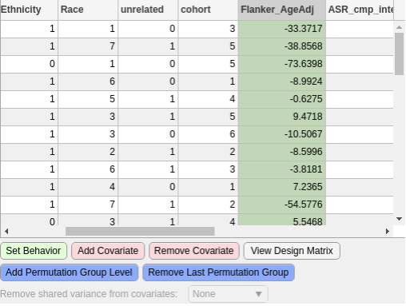

Behavior Table
=============================

    
    Behavior Table with example values

Behavior File
------------------------------------

The behavior file is a table of statistics, scores, or any other factor that should be used in the
tests. The file can be in any tabular format that is compatible with MATLAB (i.e. csv, mat, tsv).
The statistic that will be used in the tests is referred to as the "Behavior". 

Setting the Behavior
^^^^^^^^^^^^^^^^^^^^^^^^^^^^^^^^^^^

Only one field can be set as the Behavior to test against. This is done by highlighting (clicking on) 
the desired column and pressing the green button (marked :guilabel:`Set Behavior`). When clicked away from or another
column is clicked, the column should stay green. 

.. note::
    If a column is selected as a behavior or covariate(s), it must have a numerical value. No blanks or NaNs

Setting Covariate(s)
^^^^^^^^^^^^^^^^^^^^^^^^^^^^^^^^^^^^^

Setting covariates is the same as setting the Behavior except that more than column may be selected. 
Covariates can also be unselected. These actions are done by highlighting a column and pressing either of the two pink buttons 
(marked: :guilabel:`Add Covariate` and :guilabel:`Remove Covariate`). These columns should be pink afterwards.

Setting Permutation Groups
^^^^^^^^^^^^^^^^^^^^^^^^^^^^^^^^^^^^^^^

Exchangability blocks can be defind as permutation groups. These allow subsets of data to be permuted within their block. 

To do this a column(s) should be added to the behavior file. This column should be filled with non-negative whole numbers that are the same
per group. For example, one group would be 1, all of the subjects in this group should have a 1 in this column. The next group
would be 2, each subject in this group should have a 2. Continue this for the number of groups desired. This can be extended by adding/selecting
additional permutation group columns.

This column can then be selected by pushing the blue buttons (marked: :guilabel:`Add Permutation Group Level` and :guilabel:`Remove Last Permutation Group`).

*Permutation grouping is implemented using Dr. Anderson Winkler's PALM software* :cite:p:`WinklerA:2015` `github`_, `FSL`_

.. _github: https://github.com/andersonwinkler/PALM
.. _FSL: https://fsl.fmrib.ox.ac.uk/fsl/docs/statistics/palm/index.html