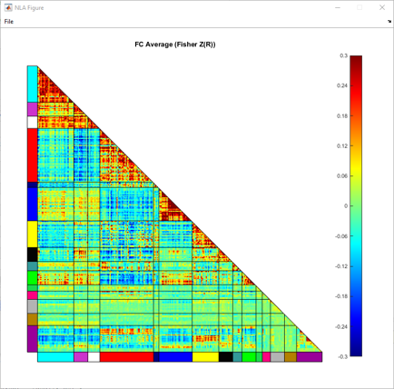
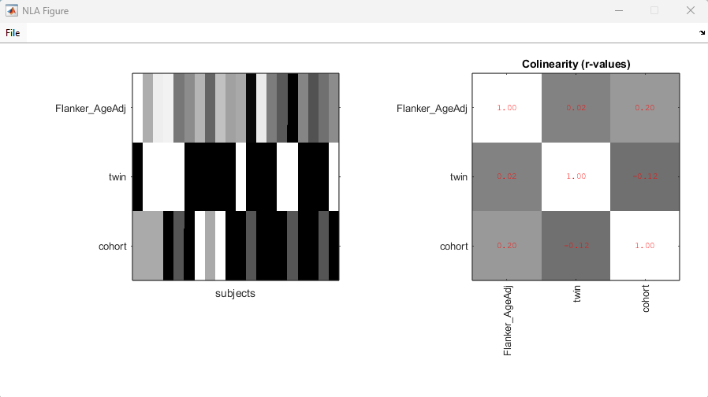
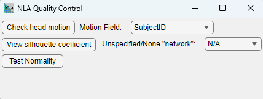
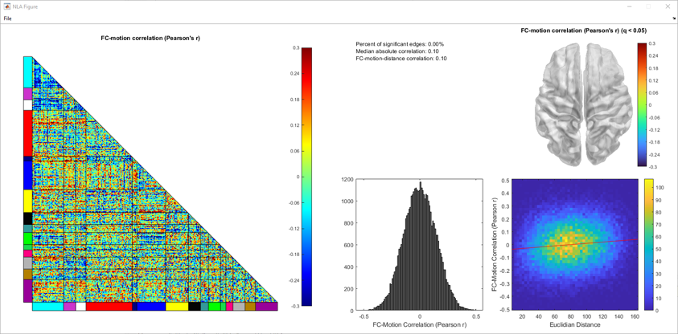
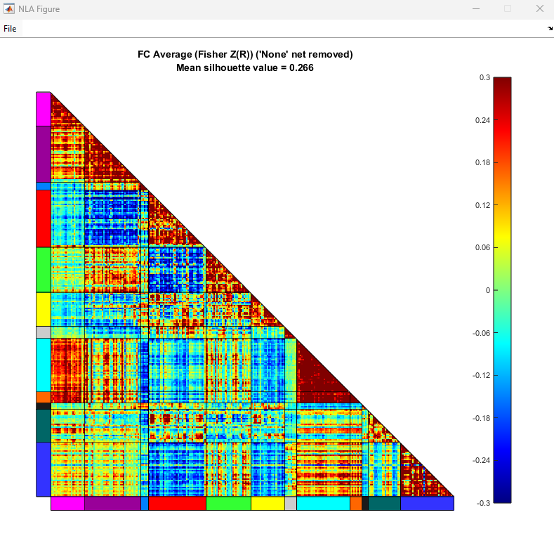
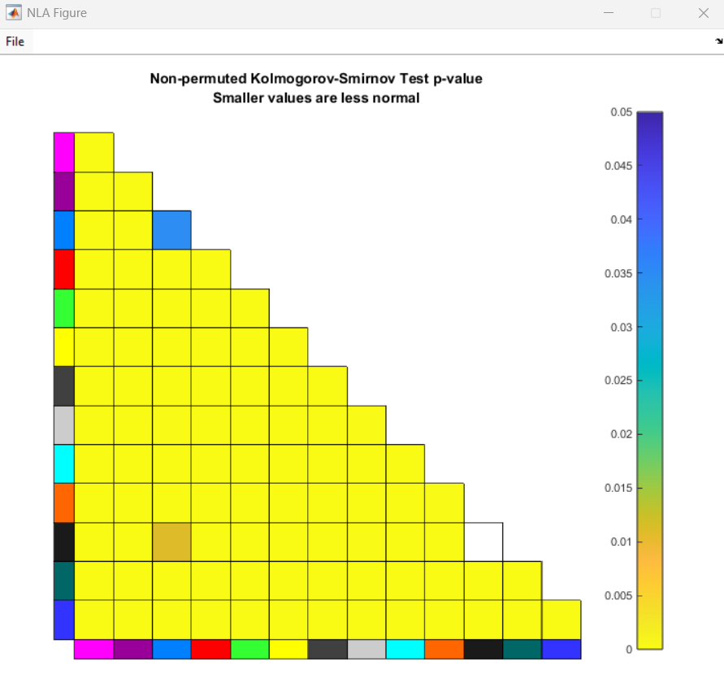

Quality Control
==============================

The NLA Toolbox offers various methods to perform quality control on input data before running permutation testing.
These consist of plots that can be generated in the main ``NLA_GUI`` window, along with a dedicated Quality Control GUI that can be launched from the main window

Quality Plots on Main NLA_GUI
---------------------------

Network Atlas Plot
^^^^^^^^^^^^^^^^^^^^^^^^^^^^^^^^^^^^^^^^^^^

After selecting a network atlas, the user can visualize the network atlas via the ``View`` button to the right of the ``Network Atlas`` selection button.

The user can select from 3 options for Inflation, which controls how inflated the cortex will be drawn. The options correspond to 'Standard', 'Inflated', and 'Very Inflated'.

If parcel information is available, the user can choose to display (or hide) that information by checking or unchecking the ``Surface parcels`` checkbox.

Viewing average Functional Connectivity
^^^^^^^^^^^^^^^^^^^^^^^^^^^^^^^^^^^^^^^^^^^

With both a network atlas and functional connectivity data file loaded, the user can view a lower triangle plot of FC averaged over all current subjects.
To do this, click the ``View`` button to the right of the button for loading Functional Connectivity.

    Example plot of average functional connectivity

Design Matrix
^^^^^^^^^^^^^^^^^^^^^^^^^^^^^^^^^^^^^^^^^^^

After loading behavior data and selecting behavior and covariate variables via the behavior table, 
the user can view the design matrix for the selected variables by clicking the ``View Design Matrix`` button below the behavior table.
This will also display r-values for colinearity between selected behavior and covariate variables.

    Example design matrix

Quality Control GUI
---------------------------

The user can also access a separate dedicated set of quality control tests via the ``Run Quality Control`` button towards the right of the GUI.

This control requires that the user has loaded a Network Atlas, Functional Connectivity, and Behavior data, 
and has selected a variable for Behavior.

    Quality Control GUI

Check Head Motion
^^^^^^^^^^^^^^^^^^^^^^^^^^^^^^^^^^^^^^^^^^^

If your selected behavior data from the main GUI included motion data, select the name of the corresponding variable in the ``Motion Field`` dropdown.
Then clicking the ``Check Head Motion`` will display quality plots relating to FC-Motion correlation :cite:p:`CiricR`. 

View Silhouette Coefficient
^^^^^^^^^^^^^^^^^^^^^^^^^^^^^^^^^^^^^^^^^^^

The user can generate a triangle plot for the silhouette coefficent for information on how well the atlas model fits the connectivity data.
If there is a network the user would like to exclude from the silhouette coefficient calculations (typically a network labeled 'None' or 'Unassigned'), the user can select that network for removal via the ``Unspecified/None "network"`` dropdown.
To keep all networks provided in the original atlas, the user can set the dropdown to the 'N/A' option.

    Example normality plot

Test Normality
^^^^^^^^^^^^^^^^^^^^^^^^^^^^^^^^^^^^^^^^^^^

The ``Test Normality`` button runs a Kolmogorov-Smirnov test on the edges within each net-pair block,
and generates a plot of the p-values for each net-pair.

    Example normality plot