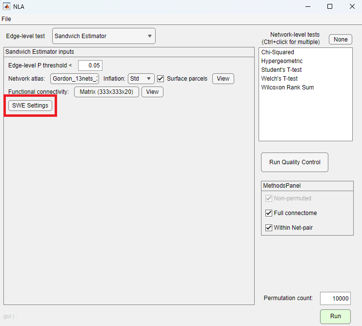
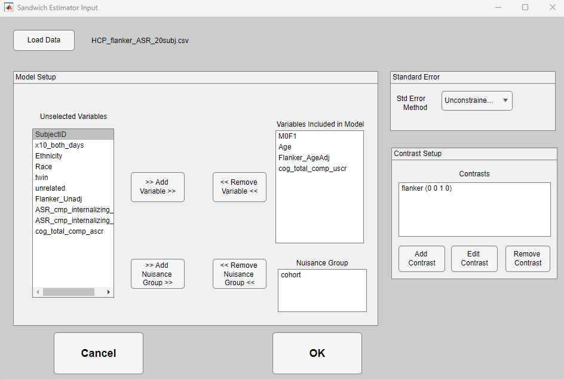
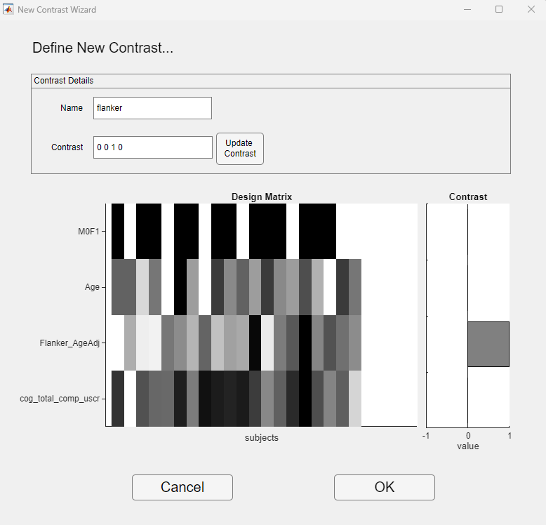

Sandwich Estimator
==============================

General
---------------------------
The Sandwich Estimator is an edge level test intended to allow modeling site and grouping effects.
The setup for this test is slightly different than the other edge level tests.

Opening Main Settings
---------------------------
In the main NLA_GUI window, click the edge-level test dropdown and select ``Sandwich Estimator``.
Most inputs will remain the same, but the ``Behavior`` control will be replaced by a button labeled ``SWE Settings``.
Enter in the Edge-level P Threshold, Network Atlas, and Functional Connectivity as normal.
After this, click the ``SWE Settings`` button for the last main step of setting up the Sandwich Estimator settings.

    Main windows with Sandwich Estimator Selected

SWE Settings Window
---------------------------

Clicking the ``SWE Settings`` button on the main GUI will open the Sandwich Estimator Input GUI. 
This window allows the user to enter in the settings required to run the sandwich estimator.

    Sandwich Estimator Input GUI

Loading Data
^^^^^^^^^^^^^^^^^^^^^^^^^^^^^^^^^^^^^^^^^^^

Click the ``Load Data`` button to select the file containing data on your behavior and covariates. 
When loaded, all column names will populate in the ``Unselected Variables`` listbox.

Selecting Variables For Your Model
^^^^^^^^^^^^^^^^^^^^^^^^^^^^^^^^^^^^^^^^^^^

Select variables you'd like included in the model from the ``Unselected Variables`` listbox, and click ``>> Add Variable >>``.
This will move those variables to the ``Variables included in Model`` listbox. 
They can be removed by selecting them in that listbox and clicking ``<< Remove Variable <<`` to push them back to the ``Unselected Variables`` listbox.

Selecting a Group Variable
^^^^^^^^^^^^^^^^^^^^^^^^^^^^^^^^^^^^^^^^^^^

If you have a Standard Error type selected that supports grouping variables, the controls for selecting a group variable will be visible.
Select one or more variables from ``Unselected Variables``, and click the ``>> Add Nuisance Group >> `` button.
If only one variable is selected, subjects with each unique value of that variable will be grouped together.
If multiple variables are selected, each unique combination of values of all of the selected variables will be assigned to its own group.

Standard Error Type
^^^^^^^^^^^^^^^^^^^^^^^^^^^^^^^^^^^^^^^^^^^

There are multiple built-in variants of the sandwich estimator that use different calculations for Standard Error.
One of these can be selected via the ``Standard Error Method`` dropdown at the top right of the Sandwich Estimator Input GUI.
The current supported options are:

* Homoskedastic (effectively an Ordinary Least Squares model)
* Heteroskedastic
* Unconstrained Blocks
* Guillaume (implements model described in Guillaume paper)

Selecting either ``Unconstrained Blocks`` or ``Guillaume`` will enable the group variable controls towards the bottom of the GUI.

Defining Contrasts for the Model
^^^^^^^^^^^^^^^^^^^^^^^^^^^^^^^^^^^^^^^^^^^

After selecting variables to include in your model, you can enter contrasts based on those variables via the ``Contrast Setup`` panel at the right of the GUI.
Clicking ``Add Contrast`` will open the ``New Contrast Wizard`` GUI.

    Sandwich Estimator Contrast Wizard GUI

**Note** Due to peculiarities with MATLAB, some controls on this page may not respond unless you move the window with the top toolbar. We are still trying to address this issue.

When this window opens, a Design Matrix should appear showing the values for all the variables you selected to be in your model.
Enter a name for the contrast, and then enter values for the contrast. After you enter the values for the contrast, click ``Update Contrast``. 
This will display the contrast values in the bar chart at the right.

The values for the contrast can be separated by spaces or commas, but must follow certain constraints:

* The number of values must match the number of variables selected for your model
* You must have at least one positive contrast
* All positive contrasts must add to 1
* If there are any negative contrasts, then the sum of all contrasts must equal 0

If these constraints are not met, an error in red will appear after clicking ``Update Contrast``.

When you've entered in all the inputs for this contrast, click OK. 
You will return to the main ``Sandwich Estimator Input`` window, and the new contrast should appear in the listbox under ``Contrasts``.
You can edit or remove existing contrasts by clicking the corresponding buttons.

Finalizing the Inputs
^^^^^^^^^^^^^^^^^^^^^^^^^^^^^^^^^^^^^^^^^^^

Once you have all required inputs for the Sandwich Estimator, you can click the ``OK`` button at bottom, and you will return to the main ``NLA_GUI`` window.