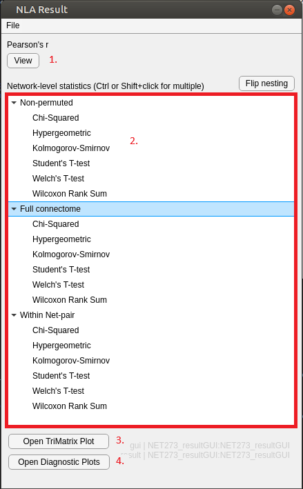
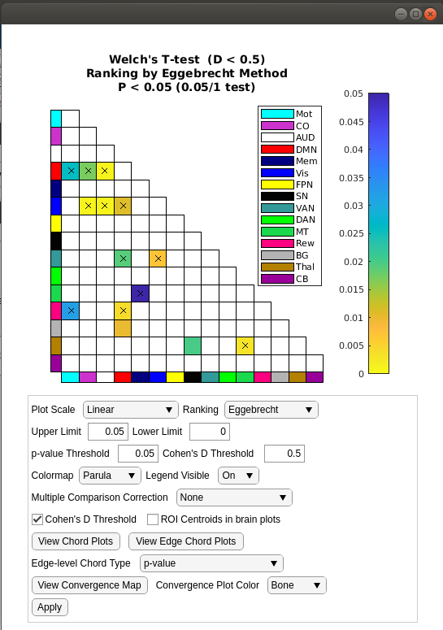

Using the GUI
==============================

Main Window
---------------------------

To start the GUI, navigate to the folder that contains the files and type ``NLA_GUI`` in the command section of the MATLAB window. 
Or, in the file browser section of the MATLAB window, right click on ``NLA_GUI.mlapp`` and select :guilabel:`Run`.

    Main windows of Network Level Analysis program

#. Edge-level test dropdown selector 
   (See :doc:`Edge-level Statistical Tests <../edge_level_tests>`)
#. Edge-level test pane
    This pane will list all of the options and inputs needed for each test that's currently selected. 
    Usually there are selectors for functional connectivity, network atlas, and behavior files. There may also be other options depending on the test.
    If "Precalculated data" is selected, there will be selectors for data instead. (See: :ref:`Precalculated data loader <precalculated>`)
#. Behavior table
    This will display the table when the behavior file is loaded. The table is used to select the behavior to test, co-variates used (optional), and 
    permutation groupings (optional). (See: :doc:`Behavior Table <../behavior_table>`)
#. Network-level test pane
    Selection of network-level test(s). One can be selected, or multiple with Ctrl/Shift + left click. 
    See :doc:`Network-level tests`
#. Run options
    Checkboxes to select test method(s). If within network pair is selected, full connectome will also be selected. 
    Permutation count is how many permutations to run. More permutations will take more time, but will produce more precise results.
    Run will run the edge level test and open the results window.

.. _loading_results:

Loading Results
^^^^^^^^^^^^^^^^^^^^^^^^^^^^^^^^^^^^^^^^^^^
If previous data was saved (See :ref:`saving results <saving_results>`) there is an option to load it here. Click the :guilabel:`File` menu in the upper left-hand corner and select :guilabel:`Load Previous Results`.
Depending on the size of the saved data, this could take a bit of time.

Results Window
----------------------------------

    Results windown with results for Network Level Analysis program

After :guilabel:`Run` is pressed in the main window, the results window will open. Initially, most of it bill be bank except for a :guilabel:`View` button to view the result
of the (non-permuted) edge-level test along with another :guilabel:`Run` button. Pressing this run button will begin running all the permutations of the edge-level and network-level test(s).

After all the permutations of the tests are run, the window will change. 

#. Edge test results display
#. Network level test results. Grouped by test method. The list can be changed to group by test by pushing the :guilabel:`Flip Nesting` button.
#. Open TriMatrix Plot.
   This opens an interactive plot of the statistics. (See :ref:`TriMatrix Plot <trimatrix_plot>`)
#. Open Diagnostic Plots. 
   These three plots 

.. _saving_results:

Saving Results
^^^^^^^^^^^^^^^^^^^^^^^^^^^^^^^^^^^^

To save results for use later (See :ref:`loading results <loading_results>`), click the :guilabel:`File` menu in the upper left-hand corner and select save. This may take a bit of time depending on how large the dataset is and how many permutations were run.
The results will be saved as:

#. a ResultPool object using models and classes from the NLA codebase. This can only be used if the NLA is in MATLAB's current path.
#. a nested structure of data that can be used without the NLA code. The structures are in the same ordering as the ResultPool, but there are no built-in classes and orderings.

.. _trimatrix_plot:

TriMatrix Plot
---------------------------------

    Trimatrix (lower triangular area) of p-values and display options

1. TriMatrix plot of p-values for selected test.
2. Options. After changing options, the :guilabel:`Apply` button must be pushed to take effect.
   There are also two buttons to display chord plots. One displays the network-level results, one displays the edge-level results. The options for these must be selected before the 
   chord plots are opened. The chord plots will not update after they are opened.