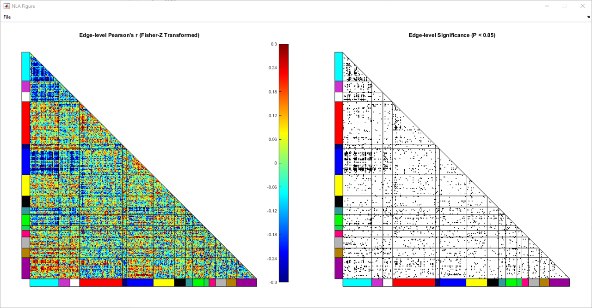
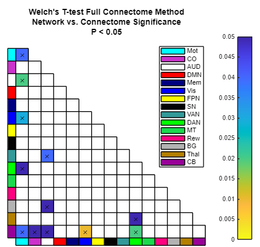
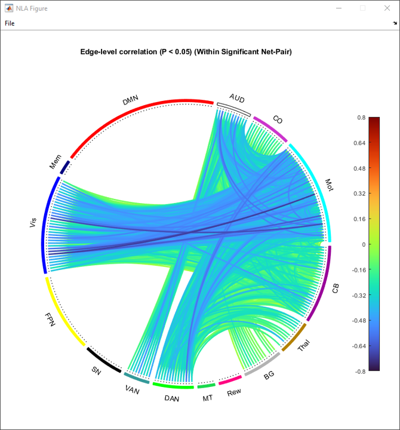
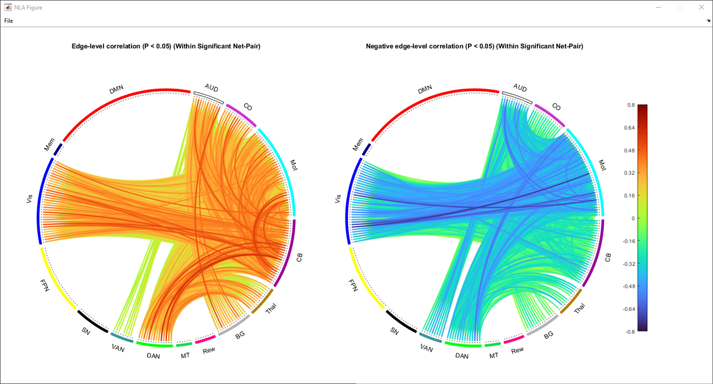
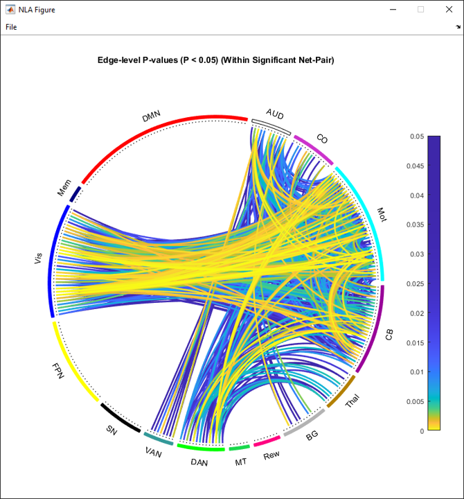
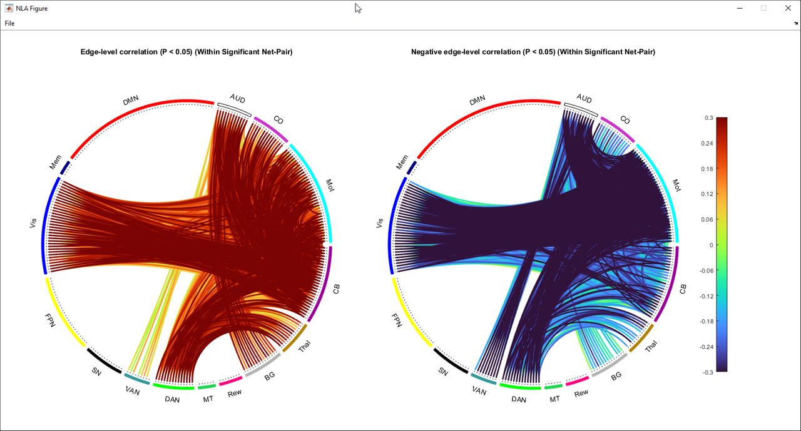
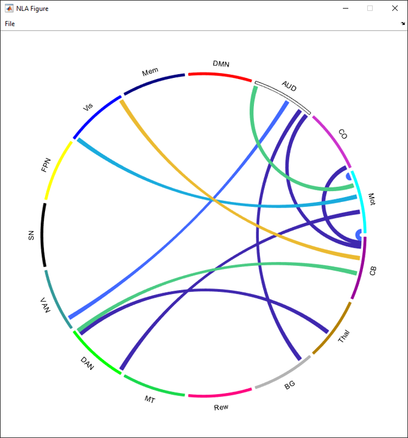
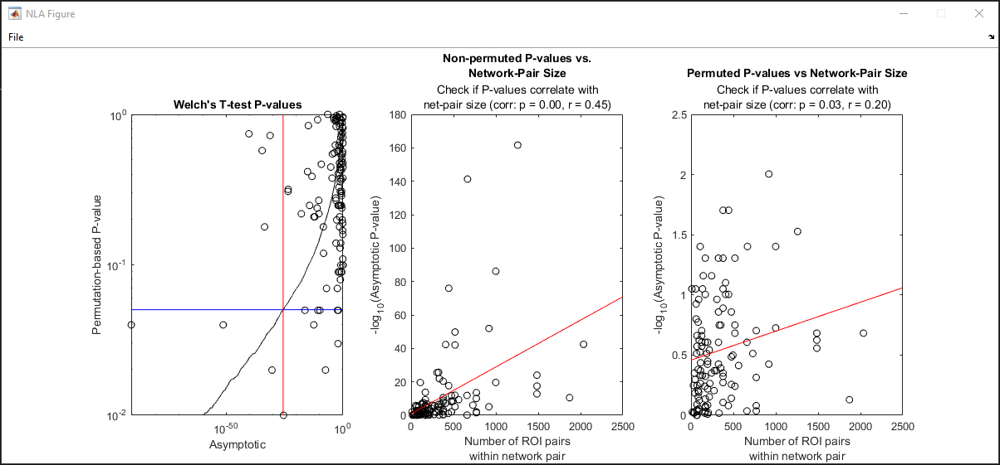

Visualizations
==============================

.. _Edge_results:

Edge-level Results
---------------------------

Edge-level Results are visualized in color as correlation coefficients and nominally thresholded and binarized p-values in black and white.

.. _Net_results: 

Network-level Results
---------------------------

Net-level results are visualized in a lower triangle matrix. (See :ref:`Lower Triangle Network-Level Results Window <net_level_results_window>`). Significant network pairs are marked with a black X.

.. _edge_chord: 

Edge-level Chord Plots
---------------------------

Edge-level chord plots show all edge-level results for significant network pairs after analysis. (See :ref:`Lower Triangle Network-Level Results Window <net_level_results_window>` for all plotting options).

    
    Type: p-value

    
    Type: coefficient

    
    Type: coefficient, split

    
    Type: coefficient, basic

    
    Type: coefficient, split + basic

.. _net_chord: 

Net-level Chord Plots
---------------------------

Net-level chord plots show all net-level results for significant network pairs after analysis.

Convergence Map
---------------------------

Convergence maps show network pairs that are significant across multiple tests and/or methods. Select multiple tests in the results window (See :ref:`Results Window <results_window>`)" and then click the :guilabel:`View Convergence Map` button. 

Network Pair Size Diagnostic Plots
---------------------------

Network pair size dianostic plots detail the effects of network pair size on results. The leftmost plot has non-permuted p-values on the x axis and permutation-based p-vaues on the y axis. The middle plot shows non-permuted p-values for all network pairs against network pair size, and the rightmost plot shows permuted p-values for all network pairs against network pair size.

